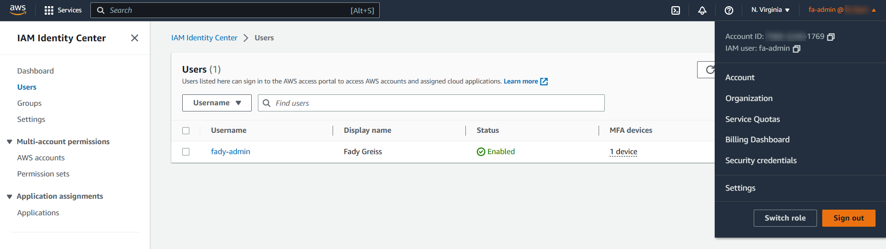

# Week 0 — Billing and Architecture
## Required Homework:
Please note that I'v blurred out a part of my AWS account number and account name as this is public repo and I'm not comfortable with showing them in public.

### Recreate Conceptual Diagram in Lucid Charts or on a Napkin:

[Conceptual diagram share link](https://lucid.app/lucidchart/333b5391-85b9-4cdb-810f-c838492974d8/edit?view_items=eC5xYggEBhh_&invitationId=inv_b9a11869-c11b-4544-989e-b23d1867cbc1)

And on an actual napkin 😉. Sorry for the bad quality! It's very hard to write on a napkin 😅.


### Recreate Logical Architectual Diagram in Lucid Charts:

[Logical diagram share link](https://lucid.app/lucidchart/37994b73-3e91-4ee8-a765-7d16c5361ca3/edit?viewport_loc=-314%2C-29%2C2873%2C1342%2C0_0&invitationId=inv_f22e2ebf-5ef0-4aca-89d3-7fce914ff8f1)

### Generate AWS Credentials:


### Installed AWS CLI:
I am not confortable using my AWS credentials in other cloud services. So I'll use the AWS CLI from my local machine specially that I recall that you said in one of the videos that it will be used for administration. And this was one of the *recommendations* that appeared in the warning message when I tried to generate an Access key from IAM to use the CLI via IAM Identiy Center.  
  
So I've installed it in my Windows local environement using powershell as follows:  
  
Searching for the package using `winget` to install the package from [Microsoft Package Manager service](https://learn.microsoft.com/en-us/windows/package-manager/winget/)
```pwsh
winget search aws             # To search for aws available packages.
```

  
Installing the package
```pwsh
winget install amazon.awscli  # amazon.awscli is the package ID found in the results of the previous commands.
```

  
Using the CLI and logging in. I'm using IAM Identiy Center and logged in as the admin user using SSO (I use the sso only for CLI access)

  
### Create a Billing Alarm:
I've created a billing alarm using the console that will trigger at >10 USD.


### Create a Budget:
I've create only one budget in the console using the forecasted amount with a maximum of 10 USD which will trigger on 80%.


## Homework Challenges
### Locking down my root account:

  
As for the security recommendation, I don't have any affected policies


###  I've checked out the Well Architected Tool:

### Enabled IAM Identity Center and created an admin group and a user:
I've followed the official [IAM Identity Center user guide](https://docs.aws.amazon.com/singlesignon/latest/userguide/what-is.html) for this task and all of the following.  
  
The created user

The created Group

### Forced IAM Identity Center users to use MFA:
And restrict their sessions to one hour.

### Created an IAM Identity Center permission set:
The permission set has only one policy to give full access to the AWS account and the sso session will be only one hour. I attached this permission set to the **Admins** group.

### Using the AWS CLI with the IAM Identity Center Admin user:
