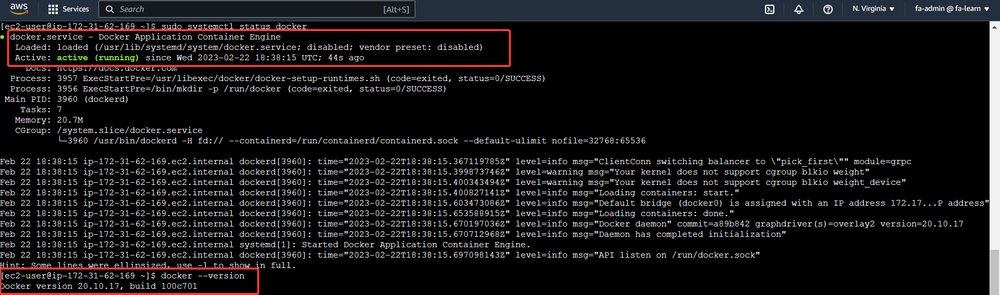
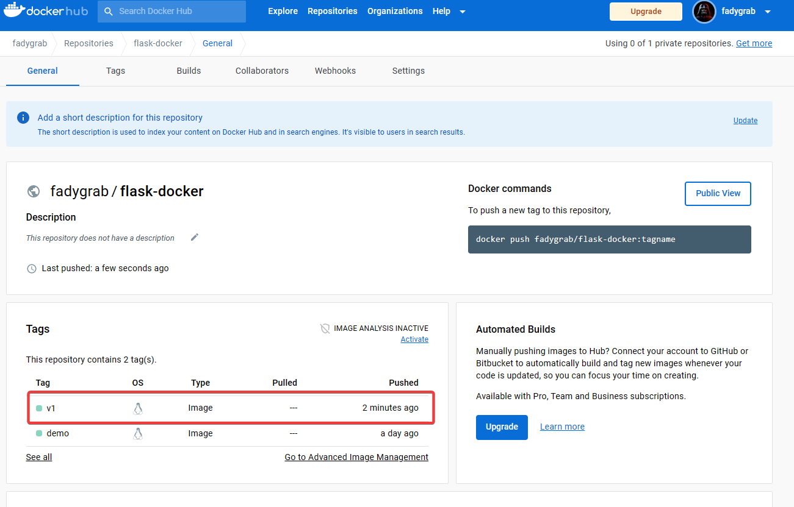

# Week 1 — App Containerization

## Required Homework:
### Containerize Application (Dockerfiles, Docker Compose)
I've built the backend and frontend containers using Dockerfile  
* Running backend-flask (build from Dockerfile)
  
* /api/activities/home response  

   
    
* Runing frontend-react-js (build from Dockerfile)

* Frontend page


* And with docker compose


* Frontend while running with docker compose using the backend API


### Document the Notification Endpoint for the OpenAPI Document:


### Write a Flask Backend Endpoint for Notifications:
* Result for the new nofications endpoint


### Write a React Page for Notifications:


### Run DynamoDB Local Container and ensure it works:
Running `docker compose ps` after `docker compose up -d` to see all the running containers. The DynamomDB container (and postgres container) are highligted.

<br>
And to ensure that dynamodb is working, I've created the table and added the item as in the instructions then listed them out.


### Run Postgres Container and ensure it works:
As for postges, I've logged in as the '*postgres*' user as instructed and listed all the databases in the db with `\l`.


## Homework chalenges:
### Intalling Docker on my local machine and running the same containers:

I've installed Docker Desktop on windows on my local enviornment and ran the containers.  
* Running docker from vscode's terminal:

* Docker desktop on Windows:


### Building a "*Hello World*" flask app localy:
I have created a very simple flask app having only one root endpoint "/" with the intention to dockerize it and push it to DockerHub then pulling it back from an EC2 ([App repo](https://github.com/FadyGrAb/aws-bootcamp-docker-flask-app)).  
I tested the app localy without docker and launched the app on port 8888
```console
flask run --host=0.0.0.0 --port=8888
```
* Flask dev server and response (without docker)

* Browser Response (actually now it isn't form docker, yet 😉)  


### Dockerize the **flask-docker** app and test it from docker:
I've created a [Dockerfile](https://github.com/FadyGrAb/aws-bootcamp-docker-flask-app/blob/main/Dockerfile) for the app to run on the container on port 8080.
```console
docker build -t flask-docker:demo . 
```
  
Then I ran the app as a container and tested it.
```console
docker run --rm -p 8080:8080 -it flask-docker:demo
```
* Flask dev server from docker

* Browser page (from docker this time 🙂)  


### Pushing the image to DockerHub:
In order to push the image, I've followed the next steps (as described in the docs [here](https://docs.docker.com/engine/reference/commandline/push/) and [here](https://docs.docker.com/docker-hub/repos/)):
* login to DockerHub from the CLI
```console
docker login
```

* Tag the flask-docker app image to match my DockerHub ID
```console
docker image tag flask-docker:demo fadygrab/flask-docker:demo
```

* And finaly pushing the image to the [DockerHub repo]()
```console
docker image push fadygrab/flask-docker:demo
```


## Pulling the image from an EC2:
I've performed the following:
* Provision an EC2 with a Role of DicrectConnect FullAccess to be able to access from the AWS portal directly.

* Install and start docker on EC2 (I have some previous experience with that).
```
sudo yum update
sudo yum install docker
sudo systemctl start docker
```


* Pull the image.  

* Run a container.  

* And finaly tested it with `curl` command. And it worked 🥳  
  
The 200 status code and the "*Hello from flask within docker*" response!

## Trying to reduce the image size and pushing it back to docker hub:
I've researched the topic of how to achieve a small image. Some of the tactics were to use minimal base images and purge any cached file for the pip (if used) and package manager. I've tried those and achieved almost 28% size reduction of the overall image size (in my local environment). Then I have commited the changes to the docker hub repo.  
* Creating a new docker file with the below changes
    - Changing the base image form ```python:3.10.10-slim-bullseye``` to ```python:3.10.10-alpine3.17```
    - Purged the pip cache in the same ```RUN``` layer to install the requirements to reduce the layers count ```RUN pip3 install -r requirements && pip3 cache purge```(another optimization tactic).
* I've built the new image form the new [dockerfile](https://github.com/FadyGrAb/aws-bootcamp-docker-flask-app/blob/main/Dockerfile.v1) and almost 75MB size reduction is achieved.
```powershell
docker build -t flask-docker:v1 -f ./Dockervile.v1 .        # The -f option is to override the default Dockerfile
```
  
* Then I've retested the new image just to be sure 😉
    1. Run the container.
    2. Test the endpoint with ```curl``` command (to save a bit of time 😁) and I goth the "*Hello from flask within docker*" phrase.
    3. And I got the 200 status code.
    4. Stopped the container.
    5. Made sure that the container doesn't exsist anymore.

Used commands:
```powershell
docker run --rm -p 8080:8080 -d flask-docker:v1     # Run the container.
docker container list                               # List the running containers.
curl [-I] http://localhost:8080                     # Get the endpoint's response. (curl must be installed in order to work. I use the executable from my local git installation on Windows)
docker container stop <container id>                # Stopping the container.
docker container list --all                         # Making sure that the container is stopped.
```


* And finally performing the same procedure to push the new image to the DockerHub repo after tagging the new image using the following steps:
    1. Listing the current images in my local enviornment.
    2. Taging the new image with my DockerHub user name.
    3. Pushing the new image.
    4. Listing the images again to see the new tag just as sanity check.

  
The new image on DockerHub 👇

