# Week 2 — Distributed Tracing

## Required Homework:
### Instrument Honeycomb with OTEL:
I've completed the Honeycomb instrumentation as per the instructions and was able to get the data into Honeycomb.io  
* Honeycomb Home visuals for the *bootcamp* environment:  
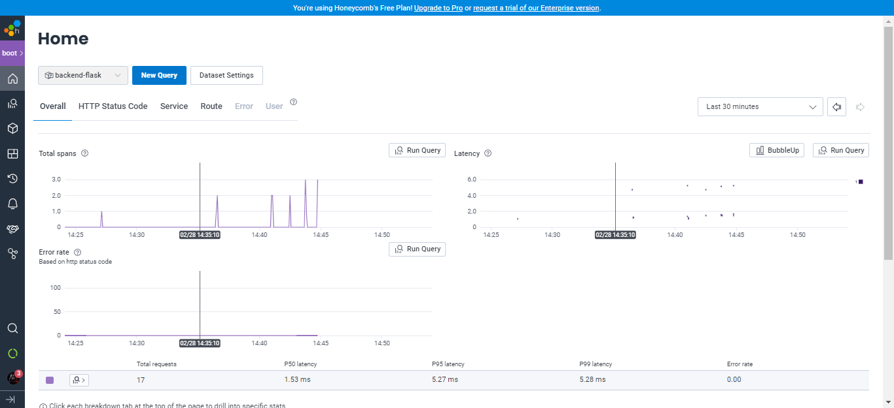  


### Instrument AWS X-Ray:
I was able to instrument AWS X-Ray as follows:  
* X-ray deamon logs  
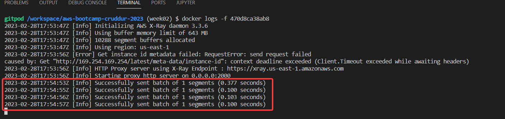  
* X-ray traces in the cloudWatch UI:  
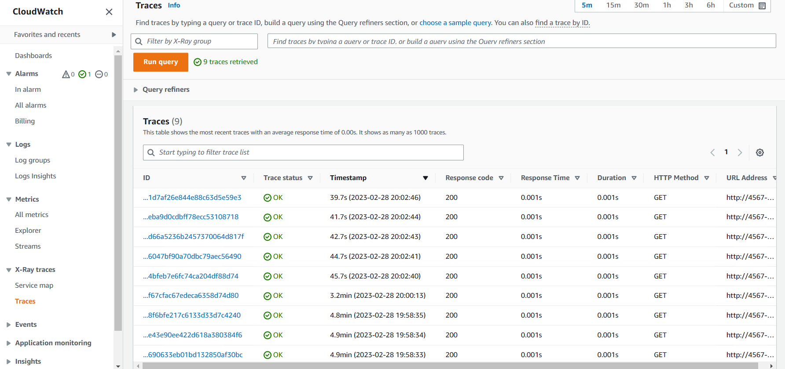  
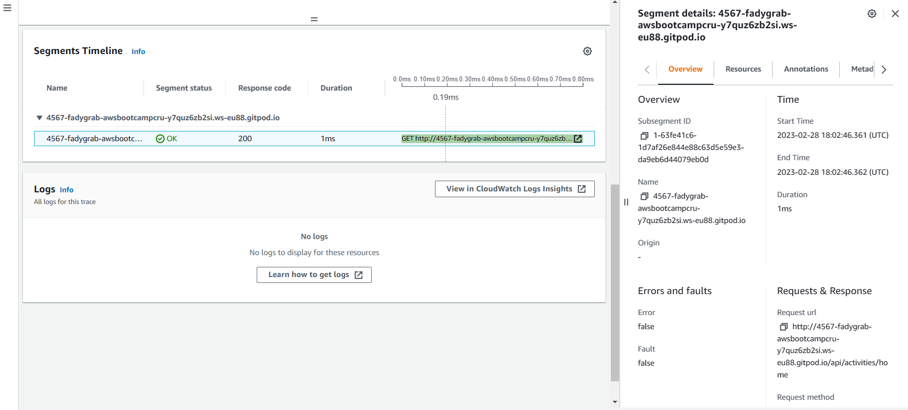  

### Configure custom logger to send to CloudWatch Logs:
I was able to send the application logs to CloudWatch:  
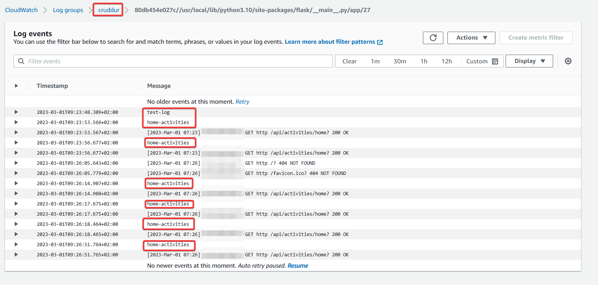  

### Integrate Rollbar and capture an error:
I have integrated Rollbar and received the warning
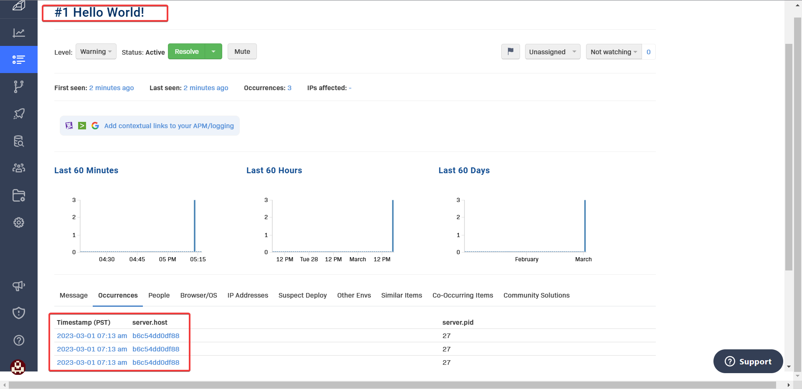  
And received an error (commented out the return from HomeActivities run function)  
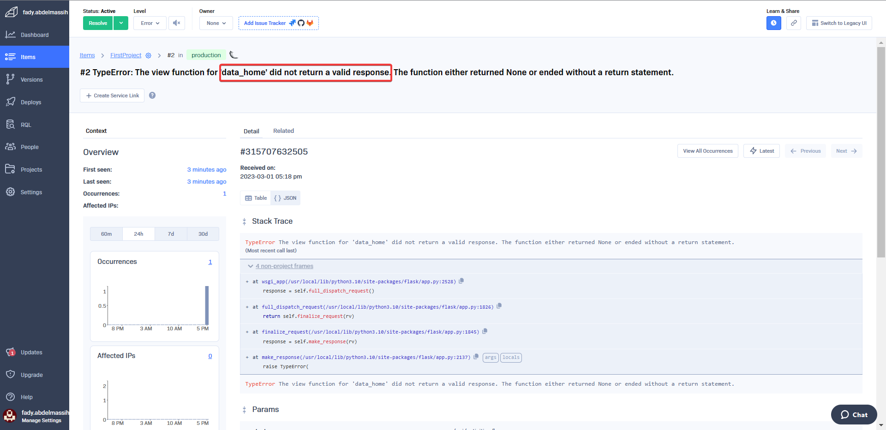 

## Homework Challenges:
### Add custom attributes to Honeycomb and use the queries:
* I've moked-up a span, added attributes to it and viewed it in Honecomb.io: 
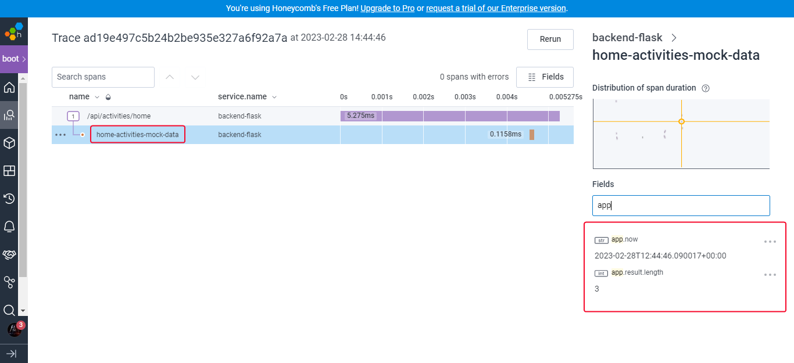  
* I've used Honeycomb queries:  
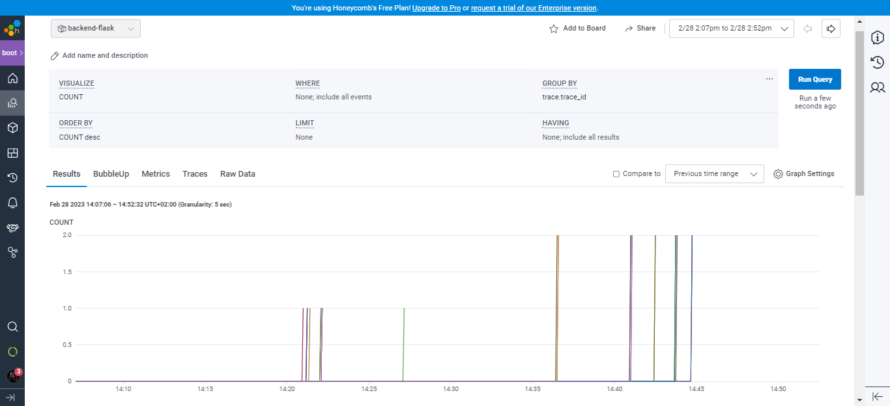  

### Add custom attributes to Rollarbar:
I've searched the [Rollbar official documentation](https://docs.rollbar.com/docs/python#transforming-the-payload) about "*Transforming The Payload*" and managed to add dummy *user* attributes that randomly change at each request to simulate the real-world app usage. This is done with a *payload handler* that I've implimented as follows:
```python
def rollbar_payload_handler(payload): 
      # Rollbar: adding the user ID to the error
      # generating a random uuid each time.
      import uuid, random
      user_id = "user-" + str(uuid.uuid4())
      payload["data"]["user.id"] = user_id # Add new key/value to the payload
      payload["data"]["user.type"] = random.choice(["standard", "premium"])
      payload["data"]["user.team"] = random.choice(["red team", "blue team", "green team", "yellow team"])
      return payload

# Add handler to rollbar
rollbar.events.add_payload_handler(rollbar_payload_handler)

```


I've added the following attributes:
* user.id
* user.type
* user.team
I've captured several error occurences in Rollarbar as follows (note the changing values)  
  
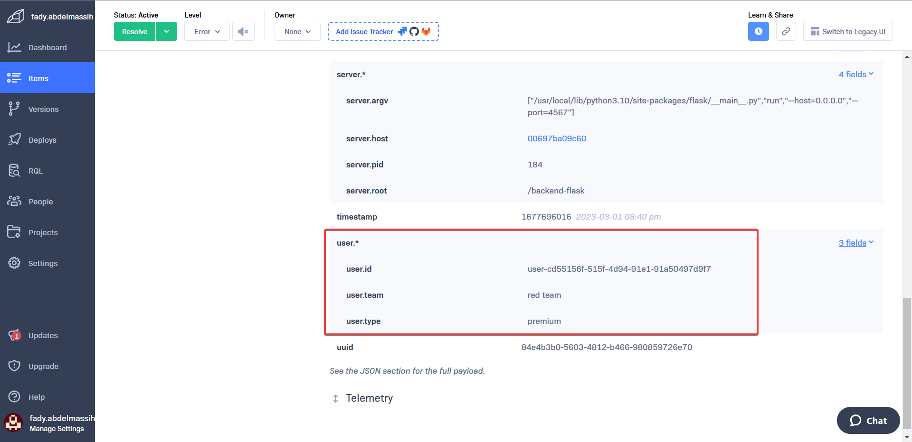  
  
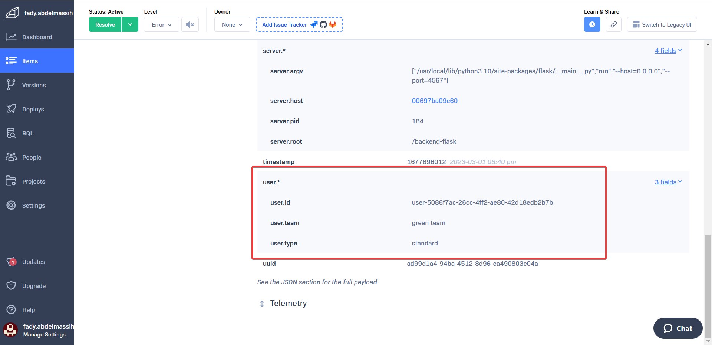  
  
After obtaining the errors, I've fixed the code again to work normally.

## Add X-ray segments and metadata:
I was able to to get x-ray subsegments working reading the [python sdk docs](https://docs.aws.amazon.com/xray-sdk-for-python/latest/reference/basic.html), **Manually create segment/subsegment**. It turned out we don't need to call *begin_segment* as I assume Flask does that when we hit an endpoint so we only need to call *begin_subsegment* to record whatever code we need to segment. Also, we have to call *end_subsegment* to finish the recording and for the record to show in AWS. For the metadata, only a key-value pair is required and we can logically group them by the *namespace* parameter (it will be '*default*' by default, I've tried it 🙂). The value can be a python dictionary for complex data structures.  
```python
subsegment = xray_recorder.begin_subsegment('home-activities-mock-data')
dict = {
      "now": now.isoformat(),
      "results-size": len(model['data'])
}
subsegment.put_metadata('key', dict, 'namespace')
xray_recorder.end_subsegment()
```
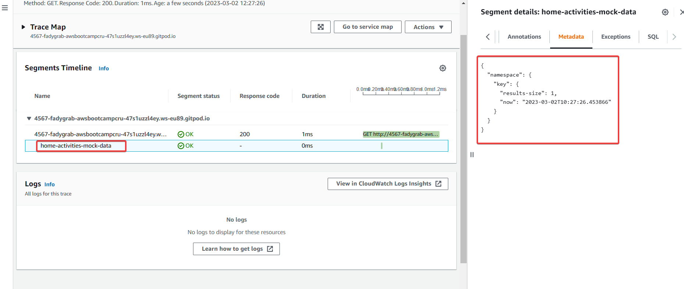  

## Creating a seperate Telemetry module:
The main motivation behind this task is that I wanted all the telemetry features introduced into the backend to be controled from one place. I didn't like the fact that I have to chase peices of code spreaded in the entire code base to comment it out/delete to be able to disable the telemetry.  
So, I've created **one** class to control the app's telemetry. It can enable/disable individual feature, pass Rollbar payload handler or disable the telemtery alltoghether. In case of the telemetry is disabled, all the related telemetry code in the app code base will be ignored and I won't have to delete or comment it.  
Because this is a big change from the original week02 required homework, I've created this task on a different branch [week02-telemetry-module](https://github.com/FadyGrAb/aws-bootcamp-cruddur-2023/tree/week02-telemetry-module/backend-flask) in order not to be confused with the orignial week02 homework.  
The [telemetry.py](https://github.com/FadyGrAb/aws-bootcamp-cruddur-2023/blob/week02-telemetry-module/backend-flask/telemetry.py) module contains the **Telemetry** class that takes the following params:  
* app: The Flask app instance.
* *_active: Where (*) can be honeycomb, 