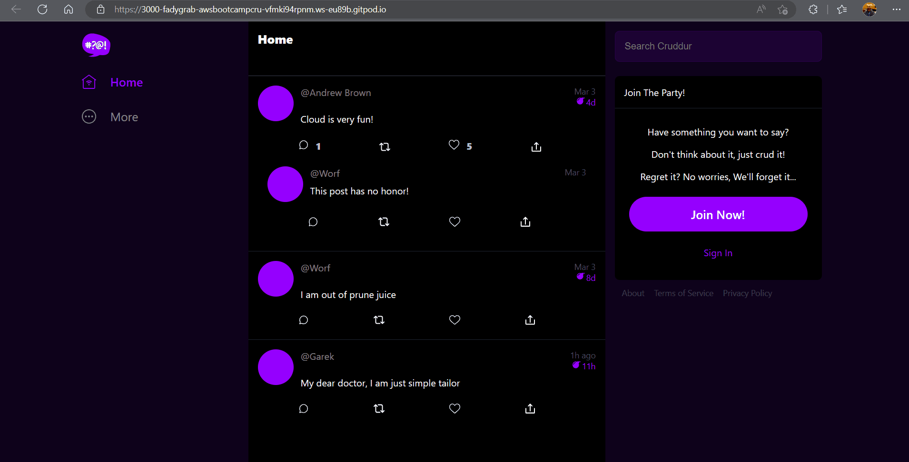
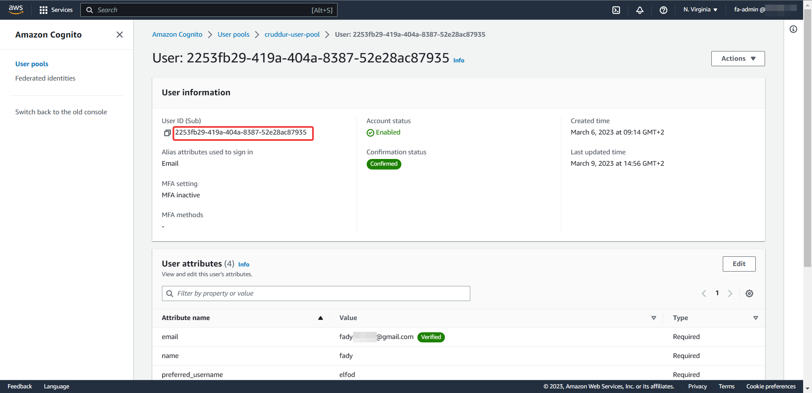

# Week 3 — Decentralized Authentication
## Required Homework:
### Setup Cognito User Pool:
I've create a cognito user pool as per the video instructions adding the "preferred_username" attribute as required.  
  

### Implement Custom Signin Page:
I've created the signin page and singed in with a previously created user "fady"  
  
  
I've noticed that the backend throws errors due to missing *jose* module when I started a new workspace after I had implemented the page following the video class earlier. I just added *python-jose* to the *requirements.txt* file and this solved the problem. 
### Implement Custom Signup Page:
I've created the signup page and used it to create another user (fady2) and confirmed it in Congito UI in the AWS console.  
  

### Implement Custom Confirmation Page:
The confirmation page is also implemented (is shown in the ***Implement Custom Signup Page*** demo). I received the verfification OTP via email and the new user (fady2)'s email has the "verified" status.  
  


### Implement Custom Recovery Page:
I've implemented the Recovery Page. And to demonstarte that it is working, I've reset the password of the (fady2) user and logged in with the new password.  
  

## Homework Challenges:
### Using a decoupled *Cognito-verifier* middleware that uses "*aws-cognito-verify.js*":
I've successfully decoupled the verfication from the app using a containerized Node.js server that uses *"aws-jwt-verify.js"*. This is my first time writing JS code (I come from Python background) and a Node.js app. While writing the Node.js server, I did a lot of searching and trial and errors. One roadblock I've encountered is that I've discovered that JS has two types of modules, The ES and common. And you can't *directly* use both in the same file.  
I've overcomed this hurdle again by doing lots of searching and a bit of experimentation on my end. The reason I need to use both ES and Common modules is that I use *express.js* (a web framework) which is a Common module and *aws-jwt-verify.js* which is an ES module. The following steps solved the issue:
* Seperate the common module in its own file with *.cjs* extension and export the object(s) you need to use in with the ES module.  
```javascript
//server.cjs
let express = require("express");
let app = express();

module.exports = app
```
* Import the "common objects" normally in the ES module.
```javascript
//index.js
...
import app from "./server.cjs";
...
```
* Change the *type* in *package.json* to *module*.

For the decoulpling to work, I've written:
1. The Node.js server and containerized it as ***cognito-verifier*** service in the *docker-compose.yaml* file and published port 5555 for the container as this is the port that the verifier listens to. Its API has two endpoints:
   1. "*/*": The home endpoints and I use it as healthcheck endpoint (the python class use it to test the connectivity).
   2. "*/verify?token=\<token\>*": The main endpoint where the verification happens. In case of successfull verification, the server returns a ***200*** status code and the content (claim) retreived from the token otherwise, it returns ***422***.
2. The python package ***cognito_verifier_middleware*** which contains the ***CognitoVerifierMiddleware*** class that handles the communications with the middleware (containerized Node.js server).

In order to use the Python class, all I need to do is import it from the ***cognito_verifier_middleware*** package and instanciate it:  
```python
# app.py
...
from lib.cognito_verifier_middleware import CognitoVerifierMiddleware
...
cognito_verifier = CognitoVerifierMiddleware(app)
...
```
To verify the JWT token, just test for its ***token_is_valid*** property which returns a boolean value (True if the token is valid)
```python
if cognito_verifier.token_is_valid:
        # Do something if the token is valid
    else:
        # Do something if the token is invalid
```
To get the *username* from the token (cognito_user_id), just use the class's ***cognito_user_id*** property provided that the token is verified.
```python
cognito_user_id = cognito_verifier.cognito_user_id
```
The class abstracts all the communications with the middleware and payload (claim) processing.

I didn't write a testing script for the class nor handled the errors properly as my goal was just to get it working similar to the original implementation in the video class and it did. In fact all the demos in the ***Required Homework*** section are using my middleware implementation and it returned the same cognito user ID as in the AWS console.  
  
