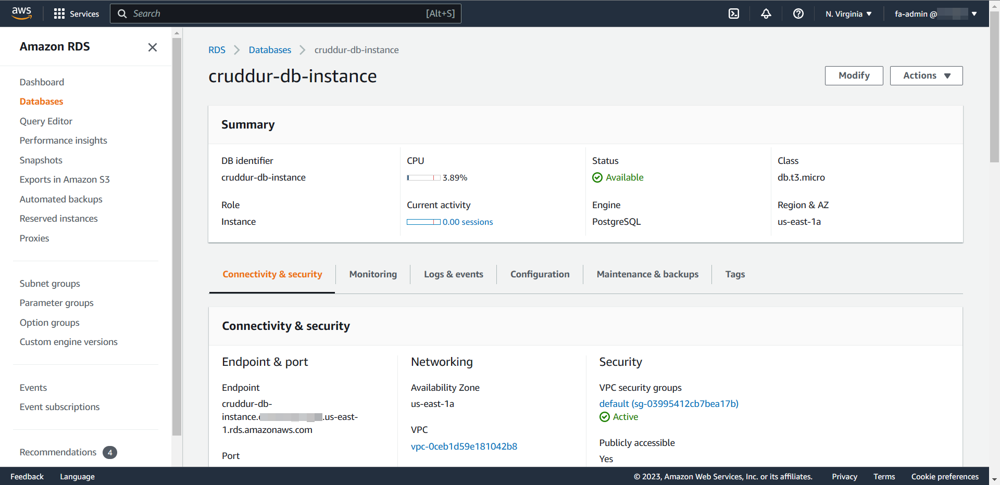
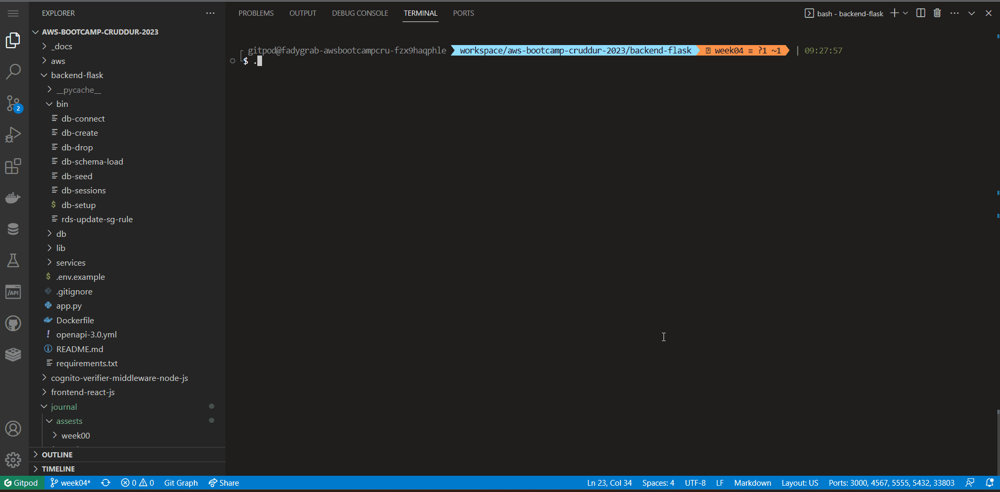
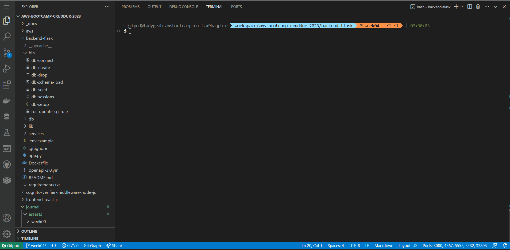
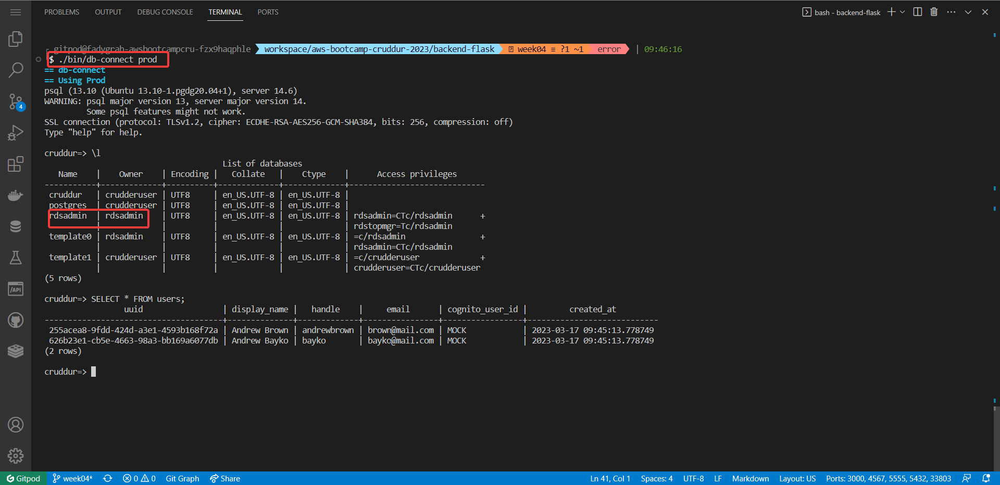
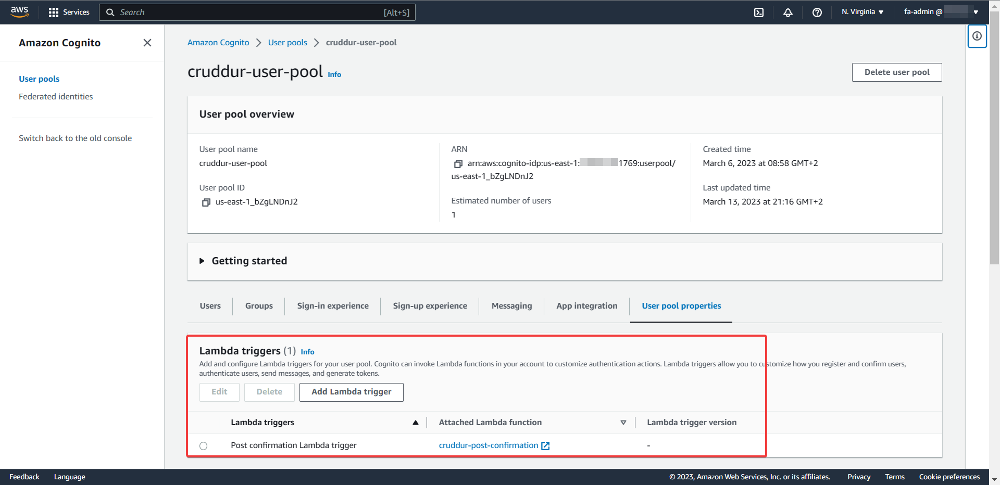
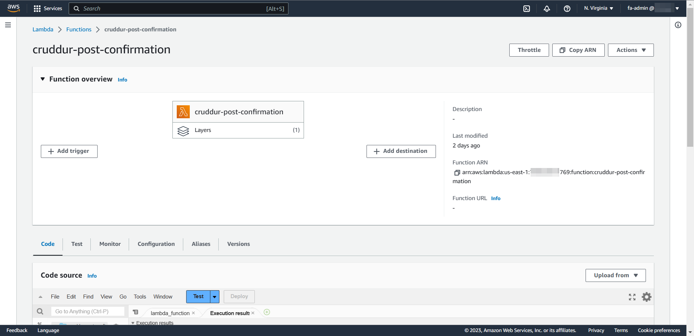
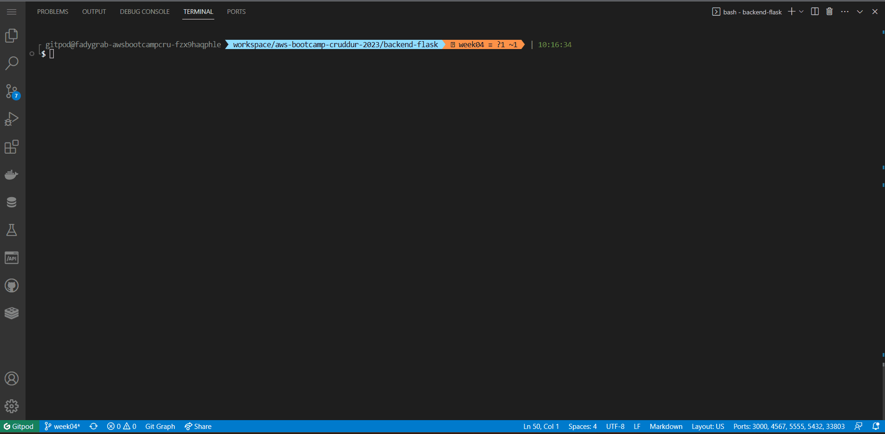

# Week 4 — Postgres and RDS

## Table of Contents

- [Required Homework](#required-homework)
  - [Create RDS Postgres Instance](#create-rds-postgres-instance)
  - [Bash scripting for common database actions](#bash-scripting-for-common-database-actions)
  - [Install Postgres Driver in Backend Application](#install-postgres-driver-in-backend-application)
  - [Connect Gitpod to RDS Instance](#connect-gitpod-to-rds-instance)
  - [Create Congito Trigger to insert user into database](#create-congito-trigger-to-insert-user-into-database)
  - [Create new activities with a database insert](#create-new-activities-with-a-database-insert)
- [Homework Challenges](#homework-challenges)
  - [Tweaking the db-setup script](#tweaking-the-db-setup-script)
  - [Creating a test for Lambda](#creating-a-test-for-lambda)

## Required Homework:

### Create RDS Postgres Instance:

I've used the CLI to create the RDS Postgres instance as instructed.  


### Bash scripting for common database actions:

I've created all the required scripts in the `backend-flask/bin` directory as follows:

- db-connect
- db-create
- db-drop
- db-schema-load
- db-seed
- db-sessions
- db-setup
- rds-update-sg-rule

Executing the scripts locally
  
Executing the scripts to prod rds


### Install Postgres Driver in Backend Application:

I've used the _psycopg_ package as instructed.

- Put in `requirements.txt`:

```
psycopg[pool]
psycopg[binary]
```

- Import and use its pool feature inside a class:

```python
# db.py
from psycopg_pool import ConnectionPool
...
class Db:
  def __init__(self):
    self.pool = ConnectionPool(os.getenv("CONNECTION_URL"))
...
```

### Connect Gitpod to RDS Instance:

I was able to connect Gitpod to the RDS instance using the db-connect script.  


### Create Congito Trigger to insert user into database:

I've created the Cognito trigger and the associated lambda function to insert the user into the database.  
Cognito Trigger:  
  
Associated Lambda:
  
Demo:


### Create new activities with a database insert:

So in order to do that, I needed to pass a valid _user_handle_ to the `Db` class to be able to insert the "crud" (activity) without errors. Initially I've receive an error complaining of a null user_uuid. Tracing the issue, I've discovered that the _user_handle_ that's passed to `CreateActivity.run` is hardcoded to "andrewbrown" which makes senses to generate an null error as I don't have that user_handle in my _users_ table (unless I signup using that handle, which I didn't). So one way I could solve this is to pass the _user_handle_ (preferred_username) from the frontend to the backend in a similar way we did for the JWT token. I've modified the _SigninPage.js_ page's `onsubmit` function to store the _user_handle_ in the browser's localStorage:

```javascript
//SigninPage.js
...
localStorage.setItem("user_handle", user.attributes.preferred_username);
...
```

Then in the _ActivityForm.js_, I'd pass the stored _user_handle_ to the backend endpoint (data_activities)

```javascript
//ActivityForm.js
...
const res = await fetch(backend_url, {
...
          user_handle: localStorage.getItem("user_handle")
});
...
```

And finally, modify `data_activities` in _app.py_ (/api/activities endpoint) to receive _user_handle_ from the received request

```python
def data_activities():
    user_handle = request.json["user_handle"]
    ...
```

This will make sure that the backend will query (and insert) the data for the correct singed in user withou throwing any errors.  
Demo:  


## Homework Challenges:

### Tweaking the db-setup script:

I've tweaked the _db-setup_ script to work with prod rds as I needed a way to reset it, clear all data and possible seeding it for test purposes. The script warns the user if he/she is using it on prod and requires an confirmation. Also, It won't seed the prod db unless the user confirmed.  


### Creating a test for Lambda:

While developing the AWS lambda, I've found that creating a test will be very useful. First I've executed the function and printed the _event_ param. Then I used the same JSON data I've received as the test template.  

