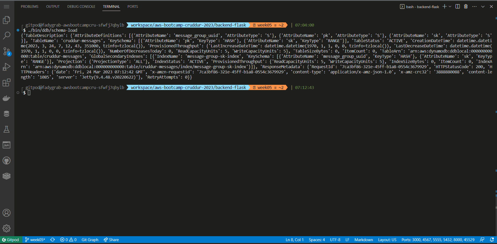
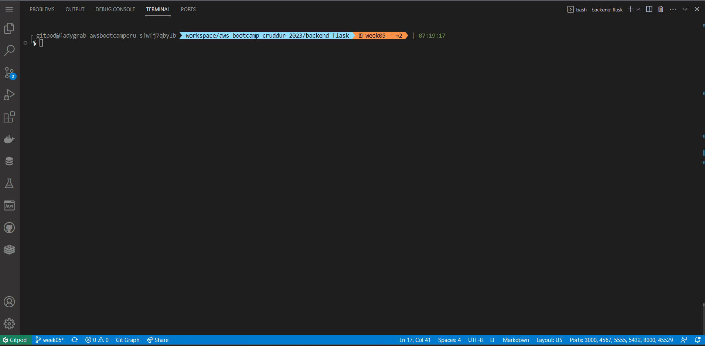
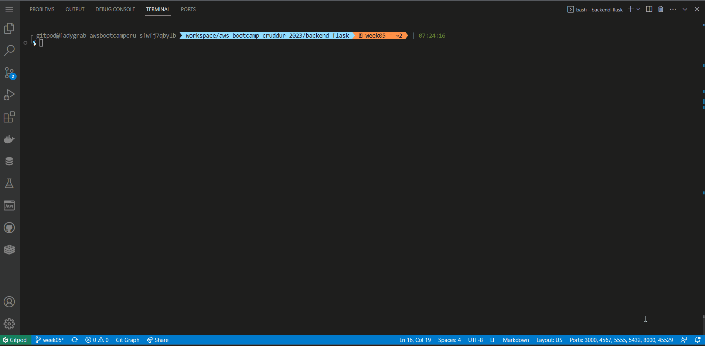
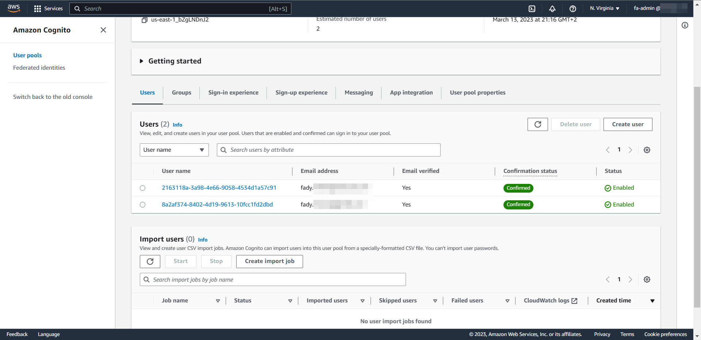
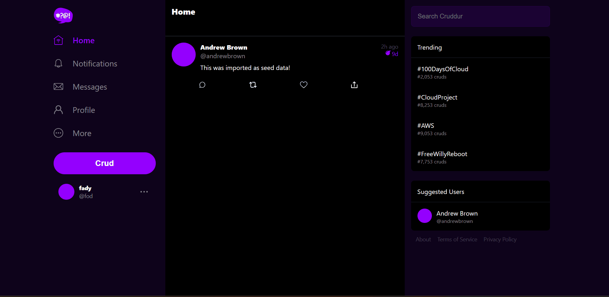
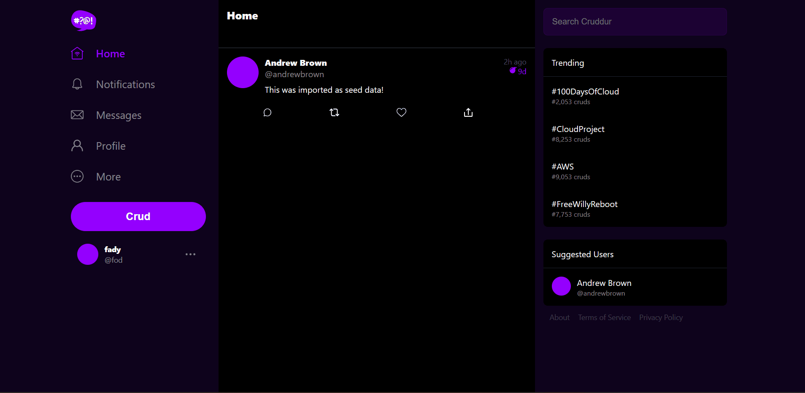
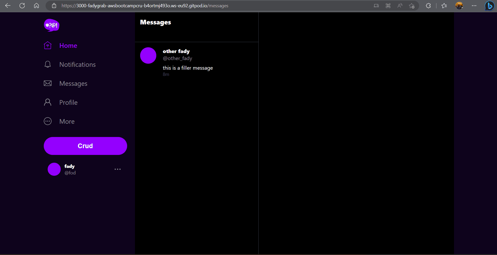
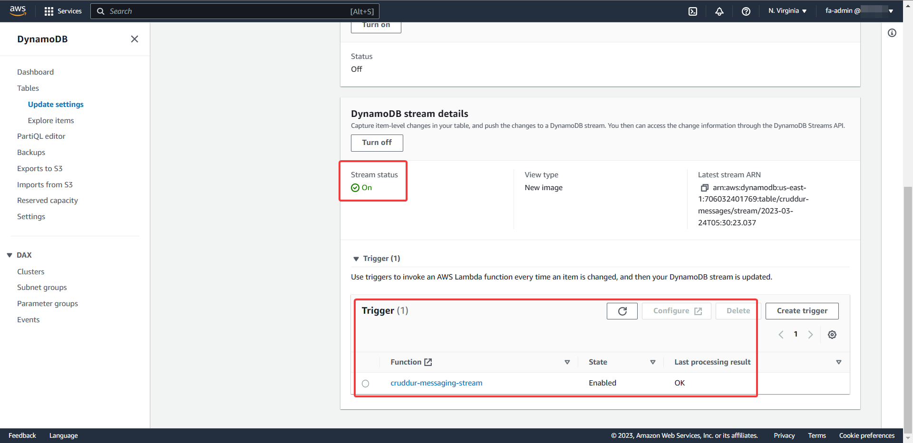
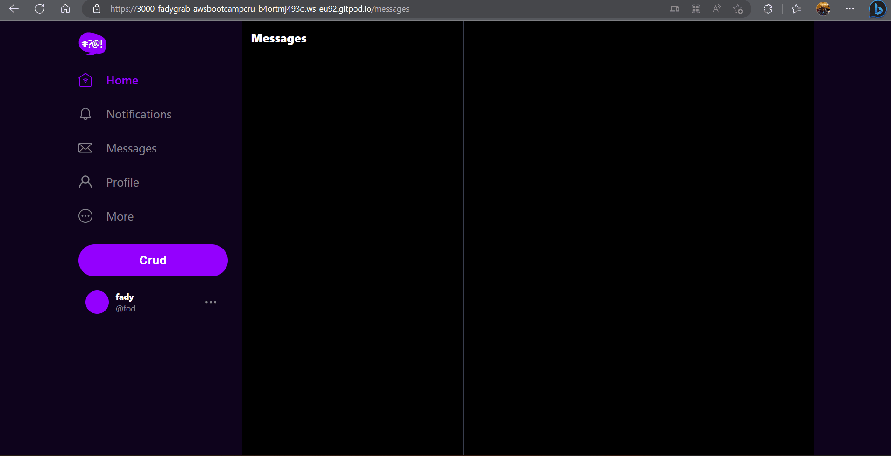

# Week 5 — DynamoDB and Serverless Caching

## Table of Contents

- [Required Homework](#required-homework)
  - [Implement Schema Load Script](#implement-schema-load-script)
  - [Implement Seed Script](#implement-seed-script)
  - [Implement Scan Script](#implement-scan-script)
  - [Implement Pattern Scripts for Read and List Conversations](#implement-pattern-scripts-for-read-and-list-conversations)
  - [Implement Update Cognito ID Script for Postgres Database](#implement-update-cognito-id-script-for-postgres-database)
  - [Implement (Pattern A) Listing Messages in Message Group into Application](#implement-pattern-a-listing-messages-in-message-group-into-application)
  - [Implement (Pattern B) Listing Messages Group into Application](#implement-pattern-b-listing-messages-group-into-application)
  - [Implement (Pattern C) Creating a Message for an existing Message Group into Application](#implement-pattern-c-creating-a-message-for-an-existing-message-group-into-application)
  - [Implement (Pattern D) Creating a Message for a new Message Group into Application](#implement-pattern-d-creating-a-message-for-a-new-message-group-into-application)
  - [Implement (Pattern E) Updating a Message Group using DynamoDB Streams](#implement-pattern-e-updating-a-message-group-using-dynamodb-streams)

## Required Homework:

### Implement Schema Load Script

I've created the _cruddur-messages_ table and the _message-group-sk-index_ GSI with the _schema-load_ script as instructed.  

### Implement Seed Script

I've created the seed script with one modification is that instead of using "andrewbrown" as my user and "bayko" as the other user, I used one of my Cognito users "fod" as my user and "other_fady" and the other user. That way I could use the Cognito Update ID script on my data. Also, I've set the base time for the seed messages to be 3 hours in the past so that every new message I create will be in after the seed messages. Without that, I would have issues displaying the new messages I create if I test it right after the seed.

### Implement Scan Script

I've created the scan script as instructed.  

### Implement Pattern Scripts for Read and List Conversations

- The list conversations script
  
- The Read conversations script
  

### Implement Update Cognito ID Script for Postgres Database

I've implemented the update Cognito ID script.
  
The Cognito user IDs from the console  

### Implement (Pattern A) Listing Messages in Message Group into Application

I've implemented Pattern A and was able to show the messages from a message group in the app.  

### Implement (Pattern B) Listing Messages Group into Application

I've implemented Pattern B and was able list the message groups in the app.  

### Implement (Pattern C) Creating a Message for an existing Message Group into Application

I was able to create a new message for an _existing_ message group (Pattern C) as follows:  

### Implement (Pattern D) Creating a Message for a new Message Group into Application

I've implemented the "create message for new message groups" (Pattern D) as follows:  

### Implement (Pattern E) Updating a Message Group using DynamoDB Streams

I've created the ddb table and GSI and enabled dynamodb streams (Pattern E):  

Functionality demo:  
  
The lambda function is envoked without errors:  

