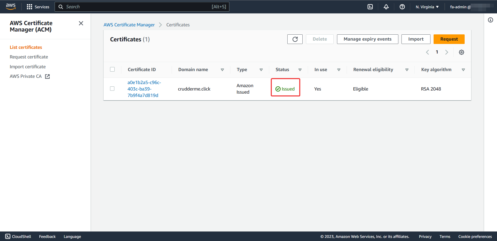

# Week 6-7 — Serverless Containers

- [Required Homework](#required-homework)
  - [Provision ECS Cluster](#provision-ecs-cluster)
  - [Create ECR repo and push image for backend-flask](#create-ecr-repo-and-push-image-for-backend-flask)
  - [Deploy Backend Flask app as a service to Fargate](#deploy-backend-flask-app-as-a-service-to-fargate)
  - [Create ECR repo and push image for fronted-react-js](#create-ecr-repo-and-push-image-for-fronted-react-js)
  - [Deploy Frontend React JS app as a service to Fargate](#deploy-frontend-react-js-app-as-a-service-to-fargate)
  - [Provision and configure Application Load Balancer along with target groups](#provision-and-configure-application-load-balancer-along-with-target-groups)
  - [Manage your domain using Route53 via hosted zone](#manage-your-domain-using-route53-via-hosted-zone)
  - [Create an SSL certificate via ACM](#create-an-ssl-certificate-via-acm)
  - [Setup a record set for naked domain to point to frontend-react-js](#setup-a-record-set-for-naked-domain-to-point-to-frontend-react-js)
  - [Setup a record set for api subdomain to point to the backend-flask](#setup-a-record-set-for-api-subdomain-to-point-to-the-backend-flask)
  - [Configure CORS to only permit traffic from our domain](#configure-cors-to-only-permit-traffic-from-our-domain)
  - [Secure Flask by not running in debug mode](#secure-flask-by-not-running-in-debug-mode)
  - [Implement Refresh Token for Amazon Cognito](#implement-refresh-token-for-amazon-cognito)
  - [Refactor bin directory to be top level](#refactor-bin-directory-to-be-top-level)
  - [Configure task definitions to contain x-ray and turn on Container Insights](#configure-task-definitions-to-contain-x-ray-and-turn-on-container-insights)
  - [Change Docker Compose to explicitly use a user-defined network](#change-docker-compose-to-explicitly-use-a-user-defined-network)
  - [Create Dockerfile specifically for production use case](#create-dockerfile-specifically-for-production-use-case)
  - [Using ruby generate out env dot files for docker using erb templates](#using-ruby-generate-out-env-dot-files-for-docker-using-erb-templates)
- [Homework Challenges](#homework-challenges)
  - [Running my cognito sidecar as a 3rd service](#running-my-cognito-sidecar-as-a-3rd-service)

## Required Homework:

### Provision ECS Cluster:

I've provisioned an ECS cluster through the AWS console using the default VPC.  


### Create ECR repo and push image for backend-flask:

I've created the **_backend-flask_** repo and pushed an image with **_latest_** tag.  


### Deploy Backend Flask app as a service to Fargate:

I've deployed the **_backend-flask_** service after registering the task definition and creating the service through CLI commands.  


### Create ECR repo and push image for fronted-react-js:

I've created the **_frontend-react-js_** repo and pushed an image with **_latest_** tag.  


### Deploy Frontend React JS app as a service to Fargate:

I've deployed the **_frontend-react-js_** service after registering the task definition and creating the service through CLI commands.  


### Provision and configure Application Load Balancer along with target groups:

I've provisioned an ALB through the AWS Console. At its final state, it had only two listeners. One at port 80 which forwards it to port 443 and the other one is on port 443.
  
I also have provisioned 2 target groups. One for the backend service and the other for the frontend service.  
frontend target group showing healthy state:  
  
backend target group showing healthy state:  
  
The ALB has a rule on the 443 port listener as it forwards the request to the backend target group if the domain URL starts with **_api_** otherwise forwards it to the frontend target group.
  
I also managed to export the ALB Access logs to S3 using this S3 bucket policy

```json
{
  "Version": "2012-10-17",
  "Statement": [
    {
      "Sid": "Statement1",
      "Effect": "Allow",
      "Principal": {
        "AWS": "arn:aws:iam::127311923021:root"
      },
      "Action": "s3:PutObject",
      "Resource": "arn:aws:s3:::cruddur-alb-access-logs-fm/*"
    }
  ]
}
```

But it turned out that it burns through S3 Free Tier requests so I've disabled it later.

### Manage your domain using Route53 via hosted zone:

In Amazon Route53, I've a hosted zone for my domain (it was created by default as I purchased my domain from AWS).  


Demo for using Cruddur over my domain:  


### Create an SSL certificate via ACM:

I've created the SSL manually through the AWS Console in Certificates Manager.  


### Setup a record set for naked domain to point to frontend-react-js:

In Amazon Route53, I've created an A record to forward the requests coming to the naked domain to the ALB. The ALB will forward the requests to the frontend target group as the condition for the 443 listener is not met.  


### Setup a record set for api subdomain to point to the backend-flask:

In Amazon Route53, I've created an A record to forward the requests coming to the api subdomain to the ALB. The ALB will forward the requests to the backend target group as the condition for the 443 listener is met.  


### Configure CORS to only permit traffic from our domain:

I've set the BACKEND*URL env var to my api sub-domain and FRONTEND_URL env var to my naked domain for the \*\*\_backend-flask*\*\* container which should configure the app's CORS to just my domain.


### Secure Flask by not running in debug mode:

I've used _--no-debug_, _--no-debugger_, _--no-reload_ options in the flask command within the dockerfile of the backend. Furthermore, I've confirmed that by connecting to the **_backend-flask_** container, running `flask shell` to get a python shell with the app context and finally checking on the value for **_app.debug_** which was False.  


### Implement Refresh Token for Amazon Cognito:

I've implemented the refresh token and made the necessary changes. I've tried to post a message after approximately 3 hours from signing in and I did that without issues but I couldn't think of a way to properly document that.

```js
// lib/CheckAuth.js
import { Auth } from "aws-amplify";

async function getAccessToken() {
  Auth.currentSession()
    .then((cognito_user_session) => {
      const access_token = cognito_user_session.accessToken.jwtToken;
      localStorage.setItem("access_token", access_token);
    })
    .catch((err) => console.log(err));
}

async function checkAuth(setUser) {
  Auth.currentAuthenticatedUser({
    // Optional, By default is false.
    // If set to true, this call will send a
    // request to Cognito to get the latest user data
    bypassCache: false,
  })
    .then((cognito_user) => {
      console.log("cognito_user", cognito_user);
      setUser({
        display_name: cognito_user.attributes.name,
        handle: cognito_user.attributes.preferred_username,
      });
      return Auth.currentSession();
    })
    .then((cognito_user_session) => {
      console.log("cognito_user_session", cognito_user_session);
      localStorage.setItem(
        "access_token",
        cognito_user_session.accessToken.jwtToken
      );
    })
    .catch((err) => console.log(err));
}

export { checkAuth, getAccessToken };
```

### Refactor bin directory to be top level:

I've refactored the bin directory. I occasionally open up the project on my local windows machine and I have created some scripts of my own that uses _Powershell_ in the **_\_mine_** directory but I excluded those from being committed.  


### Configure task definitions to contain x-ray and turn on Container Insights:

I've turned on "**_Container Insights_**" and included x-ray for each service.  
x-ray containers in the services:

- Backend
  
- Frontend
  
- Cognito Verifier Sidecar
  

Turning on **_Container Insights_**:
  


### Change Docker Compose to explicitly use a user-defined network:

I've made the required changes and tested it.  
1- Made sure that all the containers are running after a `docker compose up -d` command  
  
2- Check for docker networks using `docker network list --all`. The user defined network **_cruddur-net_** exists.  
  
3- Inspecting the **_cruddur-net_** user defined network and see which containers are using it. Using `docker network inspect cruddur-net | jq .[0].Containers` to only show the containers part, confirms that the network is used by the docker-compose conatainers.  


### Create Dockerfile specifically for production use case:

I've created a production Dockerfile for both the backend and frontend.  
  


### Using ruby generate out env dot files for docker using erb templates:

I've created the needed ruby scripts and erb templates. But instead of using `source` in the **_.gitpod.yml_** to run them, I've use `ruby /path/to/ruby/script` as those are ruby scripts and source is used for bash scripts. The files are generated once I get in my Gitpod environment.  


## Homework challenges:

### Running my cognito sidecar as a 3rd service:

I've created a 3rd service for my sidecar implementation of **_Cognito Verifier_** following the same porcess for the backend and fronten services but this one doesn't belong to any target group. The way my **_backend-flask_** communicates with it is through the internal DNS that Service Connect creates. I had to do some research and some trials to figure out this DNS name but I finally figured it out. In my case it was `http://container-name.cluster-name`.

cognito-verifier sidecar ECR repos:  

cognito-verifier running task:  

