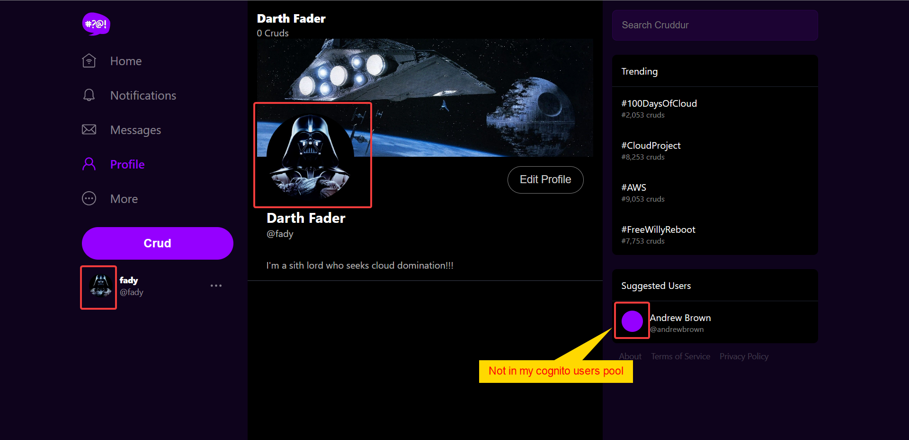

# Week 8 — Serverless Image Processing
## Required Homework
### Implement CDK Stack:
I've bootstraped the CDK and created the serverless stack with the typescript CDK. I've followed the instructions without facing any problems.
* CFN CDK stacks:

* CFN CDK stack resources:

### Serve Avatars via CloudFront:
I've setup the CloudFront distribution with a custom domain to serve assests from my "assets.mydomain" s3 bucket and created a Rout53 record for the distribution.
* CloudFront Distribution with a custom domain

* The S3 bucket as an origin in the distribution

* The distribution's Route53 Record

* Example of a successful assets fetch from the app  

### Implement Users Profile Page:
I've Implemented the user profile page that shows the banner, avatar, display name and Bio.  

### Implement Users Profile Form:
I've Implemented the user profile form where we can change the display name, bio and avatar.
  
Profile form demo:  

### Implement Backend Migrations:
I've impleneted the backend database migrations and rollbacks. I have made a small modification to the timestamp as I've found that sometimes the number of milli-seconds digit provided by `time.time()` are inconsistent and can change. And when removing the "." this could lead to wrong comparisons. So I've removed the decimal part altogether as I don't think it will impact the functionalty but instead the behaviour will be predictable.
```python
# bin/db/migrate
if last_successful_run <= file_time:
    ...
    timestamp = str(time.time()).split(".")[0]
    last_successful_run = set_last_successful_run(timestamp)
```
```python
# bin/generate/migration
...
timestamp = str(time.time()).split(".")[0]

filename = f"{timestamp}_{name}.py"
...
```
Migration demo:

### Presigned URL generation via Ruby Lambda:
I've generated a presigned URL using the Ruby lambda function and implemented a conditional run depending on the calling HTTP method either OPTIONS (CORS preflight) or POST. And used it to successfully upload the file to the S3 bucket. I made sure to set the response's CORS headers and the S3 CORS policy are correct first.
* Successful preflight:

* Successful POST:

* The receive Pre-signed URL:

* Ruby lambda logs:

### HTTP API Gateway with Lambda Authorizer:
I've configured the HTTP API Gateway and used a Lambda Authorizer that will trigger at each /avatars/key_upload POST HTTP call.
* `/avatars/key_upload` POST route with authorizer and integration Lambdas:

* `/{proxy+}` HTTP_PROXY OPTIONS route with only integration Lambda:

* Authorizer logs after each request:  

* The app is calling the API Gateway public DNS:  

### Create JWT Lambda Layer:
I've created the needed scripts to generate and upload the layer. And I have attached it to the pre-signing lambda.

### Render Avatars in App via CloudFront:
I was able to upload the avatars to the assets S3 bucket using the cognito user UUID as its filename and also serve it via cloud front. I noticed some errors in the browser dev tools console complaining about "undefined" avatars. After further investigation, It was due to the hard-coded @andrewbrown user which I don't have in my Cognito user pool. I've applied a quick fix to that until we use the CloudFront function to serve a default avatar is if the `props.id` is `null` (or `undefined`), set the `backgroundimage` to `none` in the ***ProfileAvatar*** component.
```js
//ProfileAvatar.js
export default function ProfileAvatar(props) {
  var backgroundImage = "none"
  if (props.id != null) {
    backgroundImage = `url("https://assets.crudderme.click/avatars/${props.id}.jpg")`
  } 
  const styles = {
    backgroundImage: backgroundImage,
    ...
  };
```
* Serving the avatars using the cognito user UUID:

* A successful GET for the avatar from the assets bucket using the cognito user UUID:


## Homework Challenges
### Setting up the Ruby pre-signing Lambda function to automatically set the allowed origin in the CORS headers:
I've used Ruby's Regex to match on parts of my Gitpod dev frontend URL. If it has found a match, then the Lambda will set the "***Access-Control-Allowed-Origin***" sent in the final response to the received origin in the request (which is supposed to be my current Gitpod URL). Other than that, it will set it to my production endpoint. That way only my Gitpod dev environment and my Prod domain are allowed to invoke the Lambda and I don't have to set the orgin manually each time a get a new gitpod workspace.
```ruby
...
origin = event["headers"]["origin"]
  dev_url = "https:\/\/<my gitpod prefix>-(.+)\.gitpod\.io"
  if /#{dev_url}/.match(origin).nil? # if no match return the prod domain
    origin = "<my prod domain>"
  end
...
{ 
  headers: {
    "Access-Control-Allow-Headers": "*, Authorization",
    "Access-Control-Allow-Origin": origin,
    "Access-Control-Allow-Methods": "OPTIONS, GET, POST"
  },
  statusCode: 200
}
...
```
All the preceeding examples used this implementation.