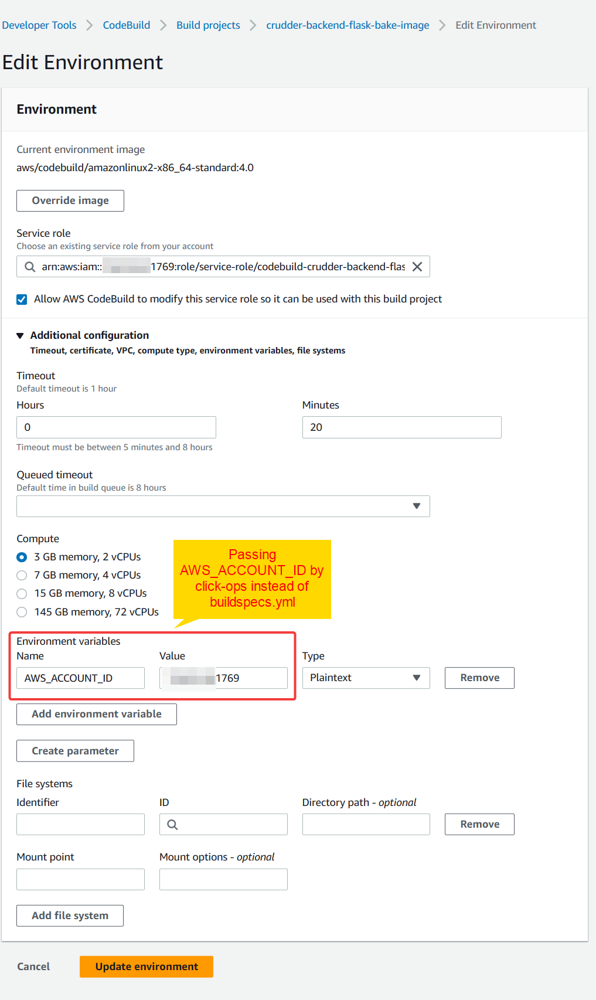

# Week 9 — CI/CD with CodePipeline, CodeBuild and CodeDeploy
## Required Homework:
### Configuring CodeBuild:
I've configured CodeBuild as per the video instructions (1 and 2) and I made sure it ran successfully. I had some minor difficulties getting CodeBuild to build the image as I switched the build command to use `Dockerfile.prod` instead of the `Dockerfile` in the instructions. And as this file uses some build args, I had to make the necessary adjustments in the `buildspecs.yml`. Also, I tried to pass ***AWS_ACCOUNT_ID*** from the CodePipeline through AWS Console click-ops as I didn't want to pass it in the `buildspecs.yml`, eventually I got it working by using 
```sh
export IMAGE_URL="$AWS_ACCOUNT_ID.dkr.ecr.us-east-1.amazonaws.com
``` 
in `buildspecs.yml`.
* Build project configs:

* Source configs:

* Environment configs:

* Buildspecs configs:

* Logs configs:

### Configuring CodePipeline:
I've configured the CodePipeline and integrated the CodeBuild project just configured.  
* Source configs:

* Build configs:

* Deploy configs:

* Successful pipeline run:

* Pipeline run demo:

* Api health check before the deployment (shows ver 1):

* Api health check after the deployment (shows ver 2):


## Homework Challenges
### Creating a local Git hook to check for my predefined sensitive data and mask it
I try to always mask any piece of data that could identify my account (AWS Account ID for example) before any commit. I was doing that manually and it proved to be tedious and not scalable. I've researched `git` and found out that it implements "hook" before and after some git actions. One particular hook called "pre-commit" is run before the actual commit to inspect the snapshot. So I've created this hook to check for my predefined secrets from a `mask.toml` config file and mask them accordingly at each commit. [Here](https://github.com/FadyGrAb/portfolio/tree/main/misc/git/pre-commit-hook-mask-data) is my implementation to this hook with details on how to install and run it. I still need to figure out a way to properly package this hook as on Gitpod it won't persist as he `.git` directory isn't pushed to Github with the `git push` command and the hooks are to bet put in `.git/hooks` directory. So I've put it in `bin/git-hooks` for reference.
