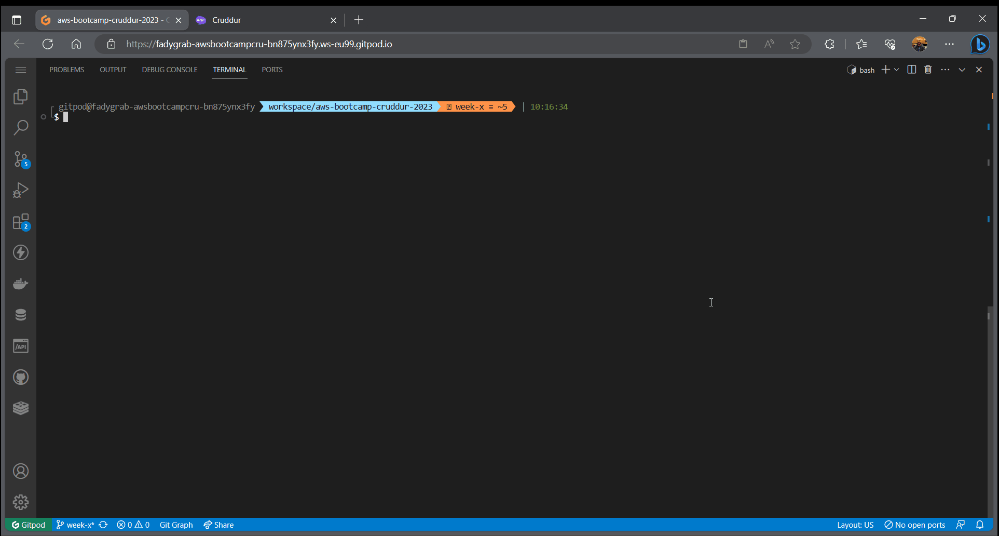
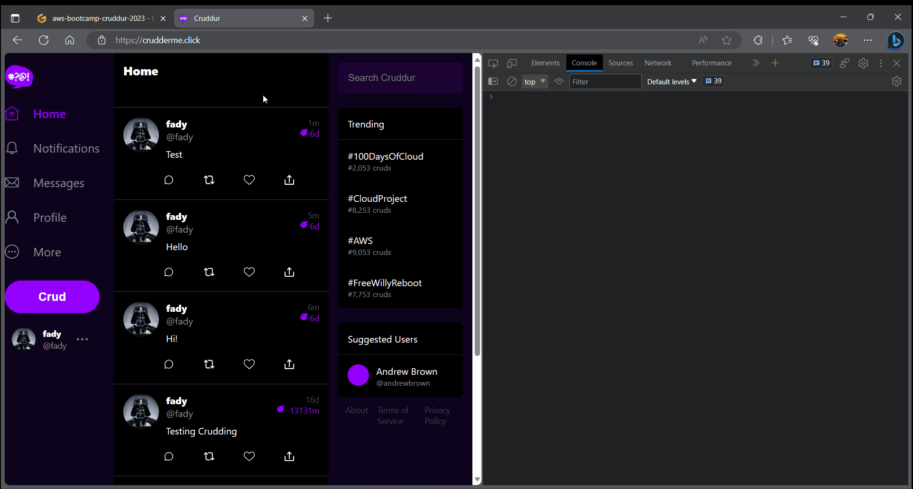
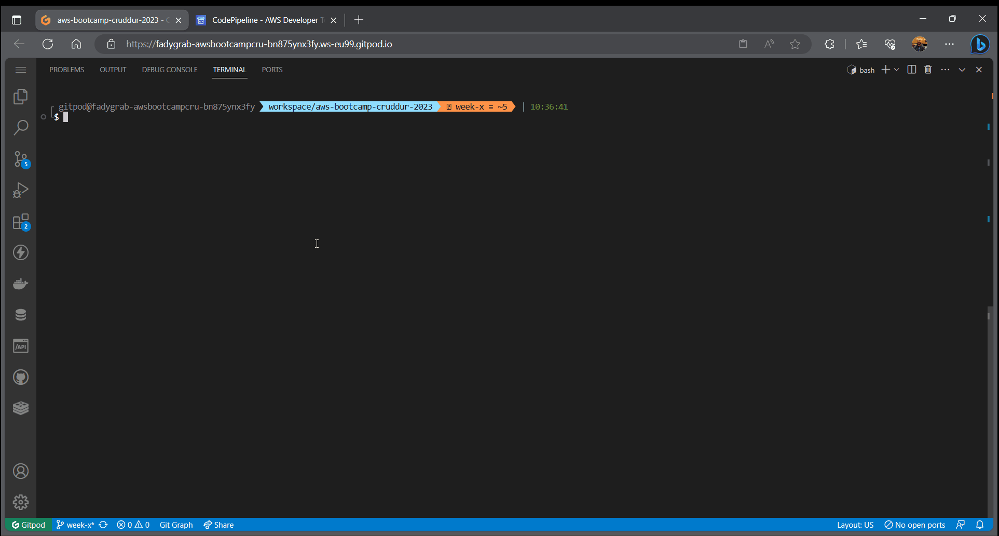
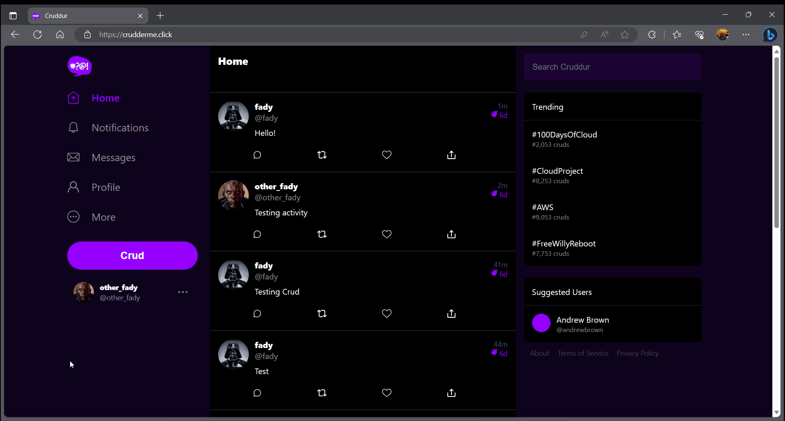
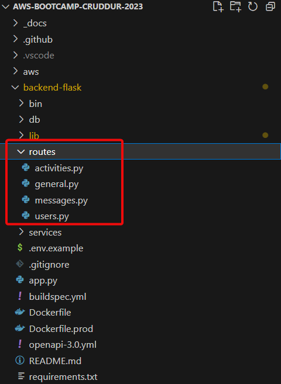
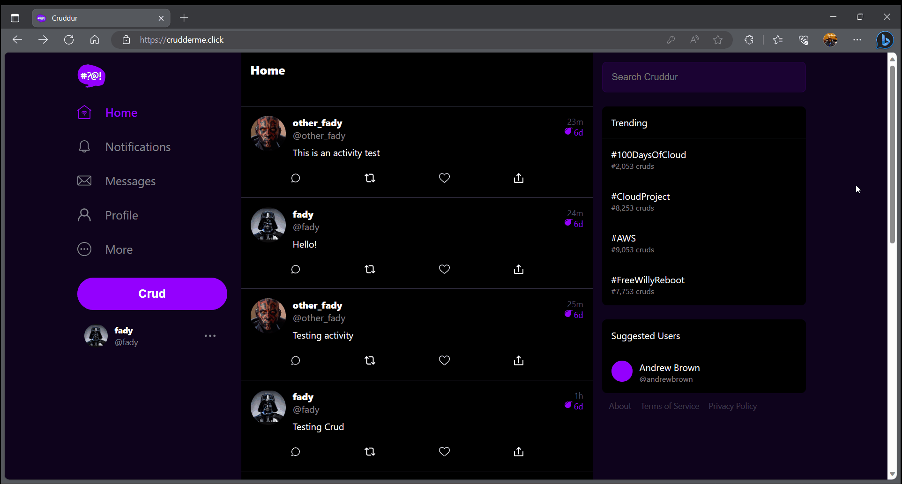
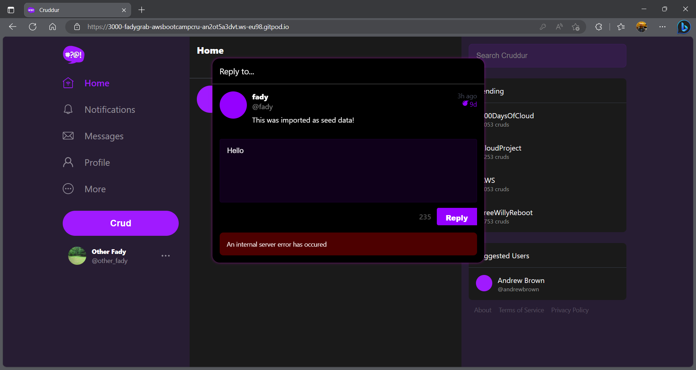
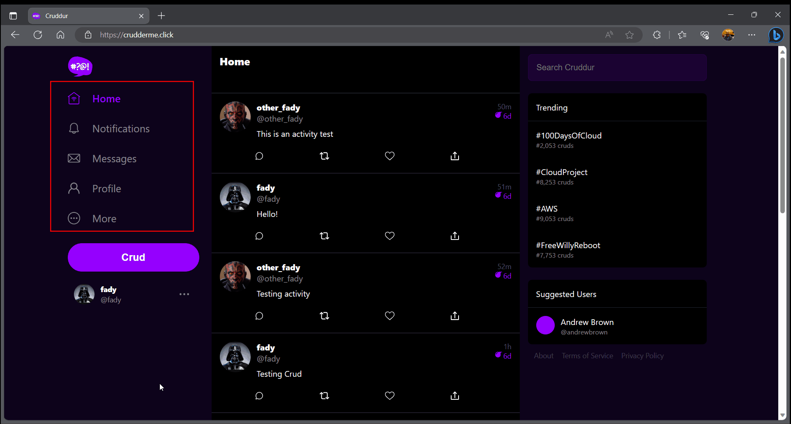
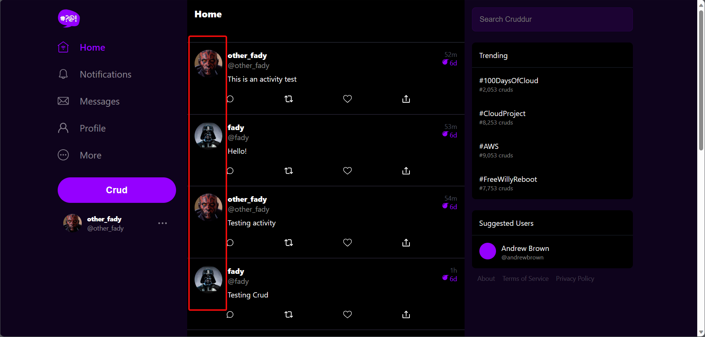

# Week X — Cleanup

## Table of Contents:

- [Required Homework](#required-homework)
  - [Week X Sync tool for static website hosting](#week-x-sync-tool-for-static-website-hosting)
  - [Reconnect DB and Postgres Confirmation Lambda](#reconnect-db-and-postgres-confirmation-lambda)
  - [Fix CORS to use domain name for web-app](#fix-cors-to-use-domain-name-for-web-app)
  - [Ensure CI/CD pipeline works and create activity works](#ensure-cicd-pipeline-works-and-create-activity-works)
  - [Refactor to use JWT Decorator in Flask App](#refactor-to-use-jwt-decorator-in-flask-app)
  - [Refactor App.py](#refactor-apppy)
  - [Refactor Flask Routes](#refactor-flask-routes)
  - [Implement Replies for Posts](#implement-replies-for-posts)
  - [Improved Error Handling for the app](#improved-error-handling-for-the-app)
  - [Activities Show Page](#activities-show-page)
  - [More General Cleanup Part 1 and Part 2](#more-general-cleanup-part-1-and-part-2)
- [Homework Challenges](#homework-challenges)
  - [Using Github Actions to build and sync the static website](#using-github-actions-to-build-and-sync-the-static-website)

## Required Homework:

### Week X Sync tool for static website hosting:

I've created the `sync` and the `static-build` scripts in `bin/frontend/` but configured them to work in with Github Actions on a `push` to `prod` branch.
Details are in the homework challenges [section](#using-github-actions-to-build-and-sync-the-static-website) related to this part

### Reconnect DB and Postgres Confirmation Lambda

The CFN created RDS instance is reconnected and new users are inserted by the post-confirmation-lambda.  


### Fix CORS to use domain name for web-app

I've fixed all the CORS issues and the web-app is working normally using the domain name `crudderme.click`  


### Ensure CI/CD pipeline works and create activity works

The CI/CD pipeline is finishing all the _source_, _build_ and _deploy_ stages successfully.  


And the _Create Activity_ also works on prod using the `crudderme.click` domain.  


### Refactor to use JWT Decorator in Flask App

I'm using my sid-cart cognito verifier and I've modified the middleware to use decorators:

```python
def jwt_required(self, func=None, on_error=None):
    if func is None:
        return partial(self.jwt_required, on_error=on_error)

    @wraps(func)
    def decorated_function(*args, **kwargs):
        try:
            if self.token_is_valid:
                return func(*args, **kwargs)
            elif on_error:
                return on_error(*args, **kwargs)
            else:
                return {}, 403
        except TokenNotFoundException as e:
            print(e)
            return {}, 401

    return decorated_function
```

### Refactor app.py

I've refactored the `app.py` as instructed.

### Refactor Flask Routes

I've refactored the routes as instructed and separated the routes in individual modules:


```python
# Load routes
routes.activities.load(app, cognito_verifier, telemetry_agent)
routes.general.load(app)
routes.users.load(app, cognito_verifier, telemetry_agent)
routes.messages.load(app, cognito_verifier, telemetry_agent)
```

### Implement Replies for Posts

Replies are implemented and tested on prod deployment  


### Improved Error Handling for the app

I've implemented the Error Handling in `Requests.js` and applied it in the React.js components  


### Activities Show Page

The _ActivitiesShowPage_ is implemented and a route is added to the `App.js` file

```js
{
    path: "/@:handle/status/:activity_uuid",
    element: <ActivityShowPage />
  },
```


### More General Cleanup Part 1 and Part 2

I've done all the cleanup in the instructional videos in addition to some of my own:

#### Only show activities in the activities page and exclude the replies:

This is done by returning

```sql
activities.reply_to_activity_uuid
```

in both the `backend-flask/db/sql/activities/home.sql` and `backend-flask/db/sql/activities/show.sql` then check it from the frontend. If it's `undefined` in the _HomeFeedPage_, then don't show it.  


#### Hide the Activities Content if the user isn't logged in

If the user isn't logged in, he/she shouldn't have access to the Activities Contents (Notifications, Messages, Profile). So I've implemented that:  


#### Show profile picture for users in the _HomeFeedPage_:



#### Fix signin page error handling:

I've fixed an error introduced when the [Error Handling](#improved-error-handling-for-the-app) part is implemented. The Signin page doesn't return an Array, so I've modified the code in `frontend-react-js/src/components/FormErrors.js` to accommodate that.

```js
if (props.errors.length > 0 && Array.isArray(props.errors)) {
  el_errors = (
    <div className="errors">
      {props.errors.map((err_code, key) => {
        return <FormErrorItem err_code={err_code} key={key} />;
      })}
    </div>
  );
} else if (props.errors.length > 0) {
  el_errors = (
    <div className="errors">
      <FormErrorItem err_code={props.errors} key={0} />
    </div>
  );
}
```

## Homework Challenges:

### Using Github Actions to build and sync the static website:

I've configured a Github Actions workflow to build the static website then sync it with the predefined S3 bucket to host the static website. The workflow consists of _one job_ that contains the following steps:

- **Checkout**: To checkout the branch into the workflow.
- **Setup Node 18**: Install Node 18 for the build stage.
- **Build site**: Build with React.js scripts (CI env var must be set to false to not treat warnings as errors as this stops the workflow).
- **Init Ruby environment**: Install Ruby runtime.
- **Sync static site**: Syncing the statics website with the sync tool.

I had to modify the `bin/frontend/sync` script a bit to be able to integrate Github Actions. I've added the following condition for the script to initiate some vars differently if it's run within Github Actions context. It uses the env var `GITHUB_ACTIONS_WORKFLOW` and checks if it's `true` or not.

```ruby
# bin/frontend/sync
if ENV["GITHUB_ACTIONS_WORKFLOW"]
  changeset_path =    "tmp/sync-changeset.json"
  build_dir =         "frontend-react-js/build"
  auto_approve =      "true"
  env_path =          "sync.env"
else
  changeset_path =    ENV["SYNC_OUTPUT_CHANGESET_PATH"]
  build_dir =         ENV["SYNC_BUILD_DIR"]
  auto_approve =      ENV["SYNC_AUTO_APPROVE"]
  env_path =          "/workspace/aws-bootcamp-cruddur-2023/sync.env"
end
```

---------TODO Insert Github Actions Demo-------------
